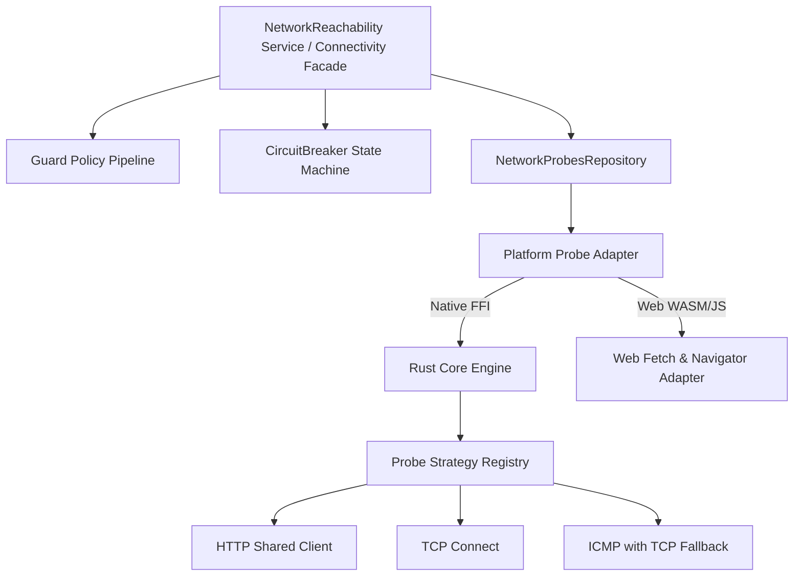

# Technical Debt Analysis & Full Clean Code Refactoring Plan

This document presents a comprehensive Technical Debt Audit and Full Clean Code Refactoring Blueprint for `network_reachability` across Dart (`lib/`, `example/lib/`) and Rust (`rust/src/`).

---

## 1. Technical Debt Inventory

### A. Architecture & Clean Code Debt
* **Domain Layer Leakage (Violation of Clean Architecture)**:
  * **Location**: `lib/src/domain/entities/entities.dart`
  * **Issue**: The domain layer directly exports auto-generated `flutter_rust_bridge` DTO models (`src/rust/api/models/...`). 
  * **Impact**: Domain logic is tightly coupled to FRB code generation details. Any change in FRB or rust model generation directly breaks public API consumer code.
* **God Class & Bloated Responsibilities**:
  * **Location**: `lib/src/application/network_reachability_service.dart`
  * **Issue**: `NetworkReachability` handles app lifecycle events, periodic scheduling, request coalescing, circuit breaker state tracking, security validation, and probe delegation in a single 350+ line class.
* **Procedural Control Flow in `guard()`**:
  * **Location**: `lib/src/application/network_reachability_service.dart`
  * **Issue**: `guard()` relies on chained procedural `if` blocks to check circuit breaker, connection status, VPN, DNS hijacking, and quality threshold. Adding new rules requires modifying this core method (violates Open/Closed Principle).

### B. Technology & Rust Engine Debt
* **Excessive Dependency Bloat in Tokio**:
  * **Location**: `rust/Cargo.toml`
  * **Issue**: `tokio = { version = "1.49.0", features = ["full"] }` pulls in process management, signal handlers, and filesystem async, bloating binary size (~10MB+) and breaking web compilation targets.
* **Deprecated DNS Resolver Crate**:
  * **Location**: `rust/Cargo.toml` & `rust/src/api/probes/dns.rs`
  * **Issue**: Uses `trust-dns-resolver`, which is deprecated in favor of `hickory-dns`. Furthermore, `task::spawn_blocking` instantiates a synchronous resolver context on every DNS probe instead of reusing an async pool.
* **Un-cached HTTP Clients**:
  * **Location**: `rust/src/api/probes/target.rs` & `rust/src/api/probes/captive_portal.rs`
  * **Issue**: `reqwest::Client::builder().build()` is called repeatedly on every probe check. Re-building clients destroys HTTP connection pooling, socket reuse, and TLS session caching.

### C. Cross-Platform & Permission Debt
* **ICMP Ping Failures on Mobile & Unprivileged Environments**:
  * **Location**: `rust/src/api/probes/target.rs`
  * **Issue**: `surge-ping` uses raw sockets (`SOCK_RAW`). Non-root Linux, Android, iOS apps, and Windows standard users do not have raw socket permissions. When `surge-ping` fails with `PermissionDenied`, the probe marks the network as **failed/offline** instead of falling back gracefully.
* **Broken / Stubbed Web (WASM) Support**:
  * **Location**: `pubspec.yaml`, `rust/src/api/probes/target.rs`, `rust/src/api/probes/interface.rs`.
  * **Issue**: Web target lacked proper WASM bundle generation and JS fallback.

### D. API Design & Developer Experience Debt
* **Clunky `BigInt` Types in Dart API**:
  * **Location**: `checkIntervalMs: BigInt`, `cacheValidityMs: BigInt`, `timeoutMs: BigInt`.
  * **Issue**: Unidiomatic Dart API. Standard Dart libraries use `Duration`.
* **Missing Compatibility with `connectivity_plus`**:
  * **Issue**: Developers switching from `connectivity_plus` had to rewrite their connection checking logic (`ConnectivityResult`, `checkConnectivity()`, `onConnectivityChanged`).
* **Example App UI Bugs**:
  * **Location**: `example/lib/main.dart`
  * **Issue**: `SingleChildScrollView(controller: PageController())` attaches a `PageController` to a non-PageView scrollable widget, causing runtime framework assertion warnings.

---

## 2. Impact Assessment & Risk Matrix

| Debt Category | Severity | Impact on App | Risk Level |
| :--- | :--- | :--- | :--- |
| **ICMP Raw Socket Permission Failures** | **Critical** | False "Offline" reports on Android/iOS/Linux | **High** (False positives/negatives) |
| **Un-cached HTTP Clients & Tokio Bloat** | **High** | Higher battery drain, latency spikes, large binary | **Medium** (Performance degradation) |
| **Domain Layer FRB Coupling** | **High** | Brittle architecture, difficult testing & refactoring | **High** (Maintainability cost) |
| **Stubbed Web Implementation** | **Medium** | Web platform unsupported | **Medium** (Platform gap) |
| **`BigInt` Dart API & Procedural Guard** | **Low** | DX friction, harder extensibility | **Low** (Developer experience) |

---

## 3. Recommended Design Patterns & Clean Code Enhancements

### 1. Strategy Pattern for Network Probes
Instead of hardcoding probe protocols inside a monolithic `switch`/`match`, implement a **Probe Strategy**:
* `HttpProbeStrategy` (Reuses shared `reqwest::Client`)
* `TcpProbeStrategy` (Uses async `tokio::net::TcpStream`)
* `IcmpProbeStrategy` (Attempts raw ping; falls back to TCP connect on `PermissionDenied`)
* `WebProbeStrategy` (Uses browser `fetch` API on WASM or `http` package)

### 2. State Pattern for Circuit Breaker
Separate circuit breaker state tracking into dedicated state objects:
* `CircuitBreakerState` interface with `ClosedState`, `OpenState`, `HalfOpenState`.
* Encapsulates state transitions (`onSuccess()`, `onFailure()`, `canExecute()`) outside `NetworkReachability`.

### 3. Chain of Responsibility / Decorator Pattern for `guard()`
Refactor `guard()` validation into a chain of policy validators:
* `CircuitBreakerPolicy`
* `ConnectivityPolicy`
* `SecurityPolicy` (VPN & DNS check)
* `QualityPolicy`

### 4. Adapter & Mapper Pattern for Domain Layer & `connectivity_plus` Compatibility
* Create pure Dart domain entities (`NetworkReport`, `NetworkStatus`, `LatencyStats`).
* Map `ConnectionType` and `NetworkStatus` to `ConnectivityResult` list for 100% `connectivity_plus` drop-in compatibility!

---

## 4. Comprehensive Refactoring Plan & Blueprint



### Phase 1: Quick Wins & Critical Bug Fixes (Sprint 1)
1. **Fix ICMP Permission Fallback in Rust (`rust/src/api/probes/target.rs`)**:
   * Catch `PermissionDenied` in `surge-ping` and fall back to TCP connection on target port (or port 80/443).
2. **Reuse HTTP Client**:
   * Store a thread-safe static/lazy `reqwest::Client` instance in Rust engine to reuse connection pools.
3. **Fix Example App**:
   * Replace `PageController()` with standard `ScrollController()` in `example/lib/main.dart`.
4. **Convert `BigInt` to `Duration` in Dart API**:
   * Provide extension methods or update model constructors to accept `Duration`.

### Phase 2: Architecture & Clean Code Refactoring (Sprint 2)
1. **Decouple Domain Entities from FRB**:
   * Define pure Dart classes in `lib/src/domain/entities/`.
   * Create `DataMapper` extensions to map FRB DTOs to pure entities.
2. **Refactor Circuit Breaker to State Pattern**:
   * Move breaker logic out of `NetworkReachability` into a decoupled `CircuitBreaker` class.
3. **Implement Connectivity Plus Compatibility**:
   * Expose `checkConnectivity()` returning `Future<List<ConnectivityResult>>` and `onConnectivityChanged` stream.

### Phase 3: Rust Engine Optimization & Web Platform Support (Sprint 3)
1. **Trim Tokio Dependencies**:
   * Update `rust/Cargo.toml`:
     ```toml
     tokio = { version = "1.49", default-features = false, features = ["rt-multi-thread", "net", "time", "sync", "macros"] }
     ```
2. **Upgrade DNS Crate**:
   * Replace `trust-dns-resolver` with `hickory-dns`.
3. **Complete Web (WASM) Bundle**:
   * Generate WASM pkg using `flutter_rust_bridge_codegen build-web --release -o web/pkg`.

---

## 5. Preventative Quality Gates & CI

1. **Rust Lints**: Run `cargo clippy -- -D warnings` in CI pipeline.
2. **Dart Lints**: Maintain strict rules in `analysis_options.yaml`.
3. **Multi-platform Verification**: Ensure Native (Android, iOS, macOS, Windows, Linux) and Web (WASM) compile cleanly.
